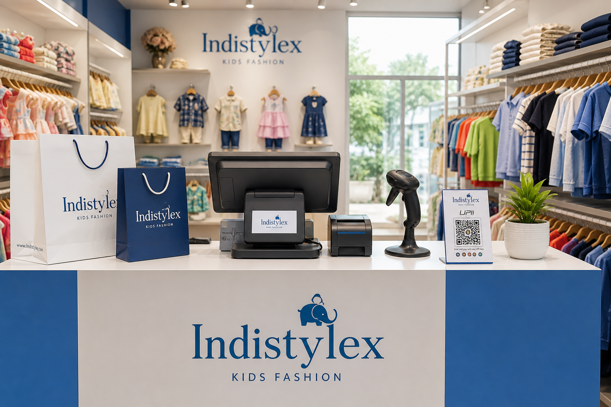
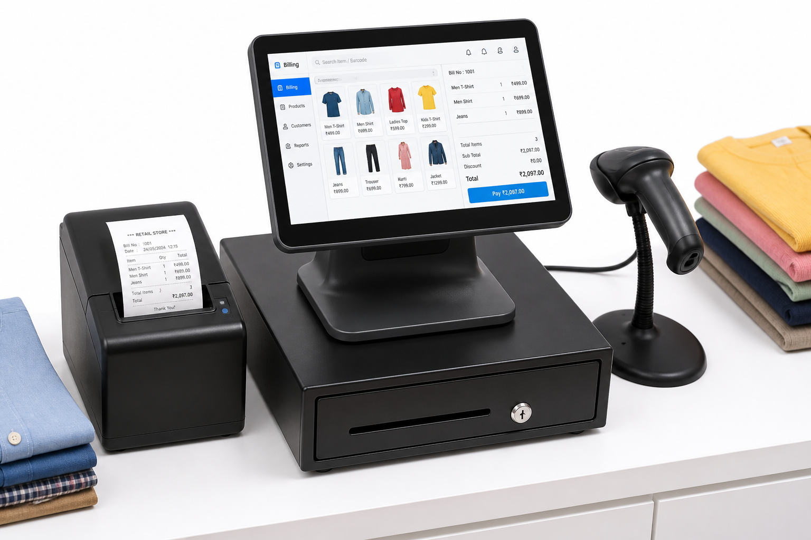
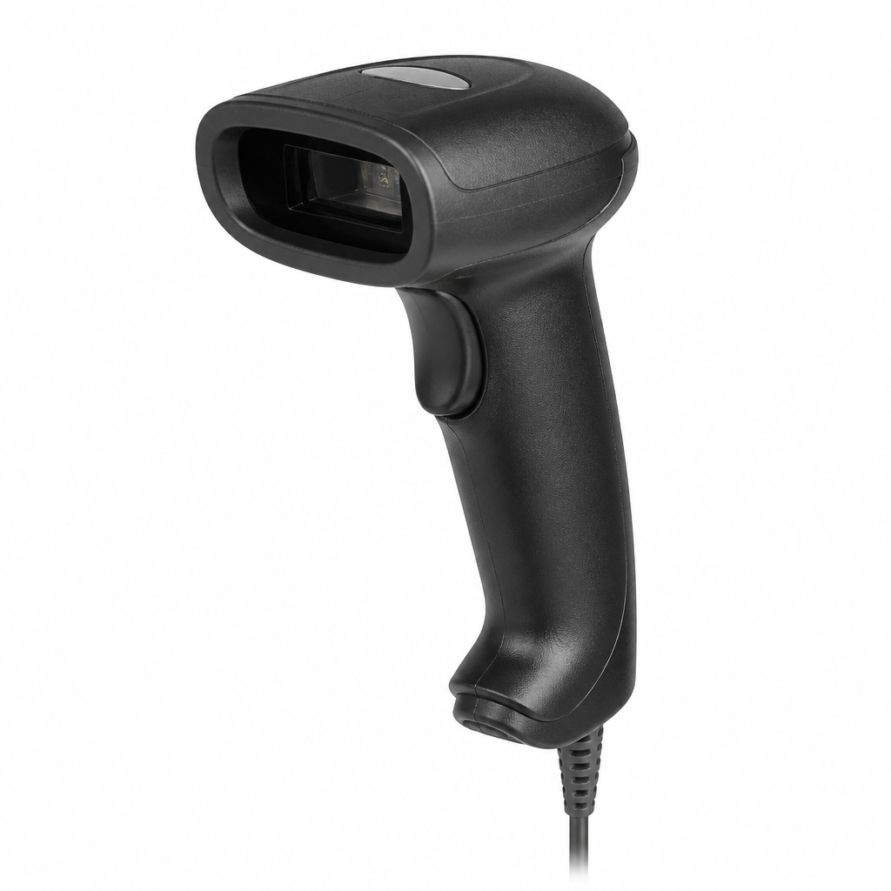
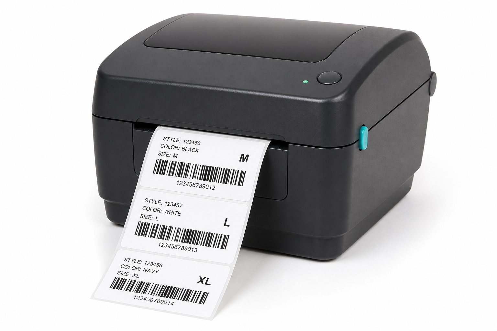
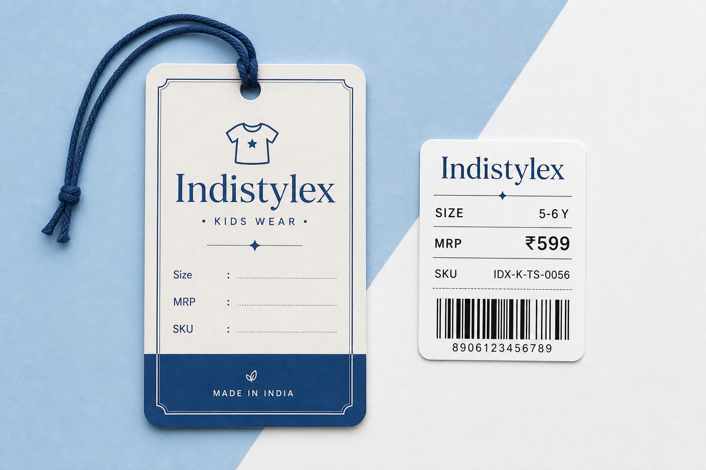
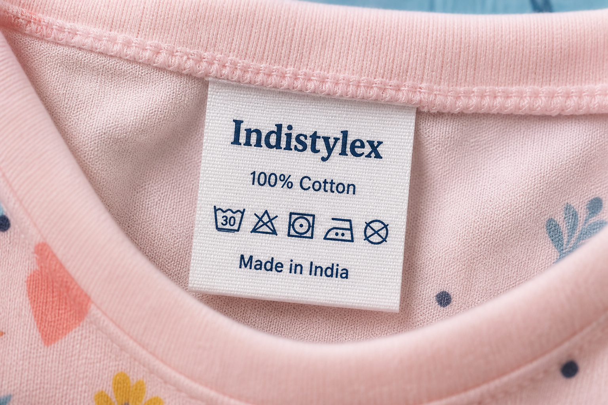

# Indistylex Physical Shop Setup Guide

Step-by-step plan to open a proper kids-wear shop: billing equipment (budget options), Indistylex labels/stickers, counter layout, where to buy, and prices.

> **Prices below are approximate India retail ranges (2025–26).** Check seller pages before buying — prices change by city, brand, and offers.

---

## Documentation & image storage

All files for this guide are in the repo under **`docs/shop-setup/`**.

| Item | Location |
|------|----------|
| This guide | `docs/shop-setup/SHOP-SETUP-GUIDE.md` |
| Index / quick links | `docs/shop-setup/README.md` |
| **All pictures** | **`docs/shop-setup/images/`** |

### Images in `docs/shop-setup/images/`

| File | What it shows |
|------|----------------|
| `shop-counter-overview.png` | Full shop counter + racks |
| `billing-pos-setup.png` | Billing machine + receipt printer + scanner |
| `barcode-scanner.png` | Handheld USB barcode scanner |
| `barcode-label-printer.png` | Thermal barcode / price sticker printer |
| `indistylex-label-mockup.png` | Indistylex hang tag + sticker design |
| `woven-care-label.png` | Sewn-in care label example |

**How to view:** open this `.md` file in Cursor/VS Code, or browse the `images/` folder directly.

---
## 1. What a proper Indistylex shop needs

| Area | Must-have | Nice-to-have |
|------|-----------|--------------|
| Billing | Laptop/tablet or POS + receipt printer + barcode scanner | Cash drawer, customer display |
| Labelling | Barcode label printer + hang tags + stickers | Woven care labels, price guns |
| Payments | UPI QR + cash | Card swipe / Soundbox |
| Store | Racks, hangers, mirror, trial area, carry bags | Mannequins, LED strips, CCTV |
| Stock | SKU list matching website variants (size + colour) | Stock register / same admin inventory |



---

## 2. Budget equipment list (with price bands)

### A. Billing / POS setup



| Item | Budget pick | Approx. price (₹) | Where to buy |
|------|-------------|-------------------|--------------|
| **Billing computer** | Used/refurbished laptop **or** Android POS tablet | 12,000 – 25,000 | [Amazon laptops](https://www.amazon.in/s?k=refurbished+laptop) · [Flipkart laptops](https://www.flipkart.com/laptops/pr?sid=6bo,b5g) · local market |
| **All-in-one garments billing machine** | Desktop POS with keypad + printer support | 12,000 – 18,000 | [IndiaMART POS billing](https://dir.indiamart.com/search.mp?ss=garment+billing+machine) · [ClanSoft-type vendors](https://www.clansoftbillingmachine.com/) |
| **Thermal receipt printer (58mm)** | USB thermal printer | 2,500 – 4,500 | [Amazon 58mm thermal](https://www.amazon.in/s?k=58mm+thermal+receipt+printer) · [Flipkart thermal printer](https://www.flipkart.com/search?q=thermal%20receipt%20printer) |
| **Thermal receipt printer (80mm)** | USB + auto-cutter | 5,000 – 9,000 | [Amazon 80mm thermal](https://www.amazon.in/s?k=80mm+thermal+printer) |
| **Barcode scanner** | Wired USB laser/CCD gun | 800 – 2,000 | [Amazon barcode scanner](https://www.amazon.in/s?k=usb+barcode+scanner) · [Flipkart scanner](https://www.flipkart.com/search?q=barcode%20scanner) |
| **Wireless barcode scanner** | Bluetooth scanner | 1,800 – 3,500 | [Amazon wireless scanner](https://www.amazon.in/s?k=wireless+barcode+scanner) |
| **Cash drawer** | RJ11/RJ12 with printer kick | 2,000 – 4,000 | [IndiaMART cash drawer](https://dir.indiamart.com/search.mp?ss=pos+cash+drawer) |
| **UPI soundbox / QR stand** | PhonePe / Paytm / BharatPe QR | 0 – 2,500 | [PhonePe Business](https://business.phonepe.com/) · [Paytm for Business](https://business.paytm.com/) · [BharatPe](https://bharatpe.com/) |
| **Garment billing software (GST)** | Cloud garment POS (size/colour variants) | ~3,000 – 8,000 / year | [Setuverse](https://www.setuverse.com/garment-shop-billing-software) · [Zubizi garments](https://zubizi.com/products/billing-software-for-readymade-garments/) · Busy / Marg (local dealer) |


#### Cheapest working billing kit (approx.)

| Kit | Items | Approx. total |
|-----|-------|---------------|
| **Ultra budget** | Your existing laptop + phone UPI + USB scanner + 58mm printer | **₹4,000 – 8,000** (+ laptop if needed) |
| **Recommended starter** | Laptop/tablet + USB scanner + 58mm/80mm printer + garment billing software | **₹20,000 – 35,000** |
| **Comfort kit** | POS machine + wireless scanner + 80mm printer + cash drawer + label printer | **₹45,000 – 70,000** |

**Tip:** You already have **Indistylex admin + online store**. For a small physical counter you can:
1. Bill on a laptop using your admin/order flow + UPI, **or**
2. Use a cheap GST garment billing app that prints barcodes, then sync stock weekly with Indistylex admin.

---

### B. Label / sticker equipment



| Item | Use | Approx. price (₹) | Where to buy |
|------|-----|-------------------|--------------|
| **Desktop barcode label printer** (direct thermal, 2–3 inch) | Price + barcode stickers | 6,000 – 15,000 | [Amazon label printer](https://www.amazon.in/s?k=barcode+label+printer+thermal) · [BluPrints India](https://bluprints.in/) · [IndiaMART label printer](https://dir.indiamart.com/search.mp?ss=barcode+label+printer) |
| **Portable Bluetooth label printer** | Small stickers from phone | 3,500 – 8,000 | [Amazon portable label printer](https://www.amazon.in/s?k=portable+bluetooth+label+printer) |
| **Label rolls** (40×30 mm / 50×30 mm) | Product stickers | 200 – 600 / roll | [Amazon thermal labels 40x30](https://www.amazon.in/s?k=thermal+label+roll+40x30) · [IndiaMART label rolls](https://dir.indiamart.com/search.mp?ss=thermal+label+roll) |
| **Hang tag cards** (custom printed) | Brand look on garments | 1 – 4 / piece (bulk) | Local print shop · [IndiaMART hang tags](https://dir.indiamart.com/search.mp?ss=garment+hang+tags) · [Canva design](https://www.canva.com/) |
| **Plastic tag fasteners / string** | Attach hang tags | 50 – 150 / pack | [Amazon tag gun fasteners](https://www.amazon.in/s?k=tag+gun+fasteners+garment) · [IndiaMART tag gun](https://dir.indiamart.com/search.mp?ss=tag+gun+fasteners) |
| **Woven care labels** | Sewn inside garment | 1.5 – 5 / piece (bulk) | [IndiaMART woven labels](https://dir.indiamart.com/search.mp?ss=woven+labels+garment) |
| **Size stickers** (age bands) | Quick visual sorting | 0.3 – 1 / piece | Local stationery · [IndiaMART size stickers](https://dir.indiamart.com/search.mp?ss=size+stickers+garment) |
| **Carry bags** (printed Indistylex) | Branding at checkout | 3 – 12 / bag | Local packaging supplier · [IndiaMART carry bags custom print](https://dir.indiamart.com/search.mp?ss=custom+printed+carry+bags) |
---

## 3. Indistylex clothing labels & stickers — how to do it



### 3.1 Label types you should use

| Type | Where it goes | Must show |
|------|---------------|-----------|
| **Hang tag** | String/fastener on garment | Logo, product name/line, size, MRP (incl. GST), SKU, “Indistylex” |
| **Barcode / price sticker** | Back of hang tag or garment polybag | Barcode, SKU, size, colour, MRP |
| **Woven / satin care label** | Inside neck or side seam | Brand, fabric, wash care, “Made in India” |
| **Size sticker** | Near hang tag or shelf | Age band (e.g. 2–3Y) or size |



### 3.2 Brand rules (keep every tag consistent)

- **Brand name:** Indistylex  
- **Primary colour:** deep blue `#1E4D8C` on white/cream tag  
- **MRP:** always printed (Legal Metrology)  
- **SKU:** same as website/admin variant SKU (e.g. `IX-FRK-PINK-34`)  
- **Size:** use your age bands (`2–3Y`, `3–4Y`…) so shop and website match  
- **Contact:** website `indistylex.com` + WhatsApp / shop phone on hang tag back (optional)

### 3.3 Step-by-step: create & print Indistylex labels

#### Option A — In-shop (fast, cheapest long-term)

1. Buy a **direct thermal barcode printer** + **40×30 mm** or **50×30 mm** sticker rolls.  
2. Install printer software / use billing software “Print barcode label”.  
3. For each variant in stock, print a sticker with:
   - `Indistylex`
   - Product short name
   - Size + colour
   - SKU
   - MRP
   - Barcode (EAN-13 or Code128 of SKU)
4. Stick on hang tag **or** polybag.  
5. Attach hang tag to garment with fastener.

#### Option B — Print shop / Canva (best brand look for hang tags)

1. Design hang tag in **Canva** (size tip: **50×90 mm** or **60×100 mm**, front + back).  
2. Front: logo + brand + product line.  
3. Back: Size, MRP, SKU, barcode space, care icons, website.  
4. Export PDF (print-ready, 300 DPI).  
5. Give to local printer: art card 300–350 GSM + punch hole.  
6. Order **500–2000 pcs** to keep per-tag cost low.  
7. Leave a blank area on the back for the thermal barcode sticker (so price/SKU can change without reprinting all tags).

#### Option C — Woven care labels (for packed stock)

1. Finalise text:
   - `INDISTYLEX`
   - `100% Cotton` (or actual fabric)
   - Wash icons / “Gentle wash, do not bleach”
   - `Made in India`
2. Order from IndiaMART / label manufacturers (minimum often 500–1000 pcs).  
3. Give exact size (e.g. 60×20 mm) and navy+white colours.  
4. Factory or tailor sews into garments before display.

### 3.4 Suggested hang-tag layout (copy)

```
┌─────────────────────────┐
│      INDISTYLEX         │
│   Kids Wear · Since …   │
│                         │
│   Floral Cotton Frock   │
│   Size: 3–4Y            │
│   Colour: Pink          │
│                         │
│   MRP: ₹899 (Incl. GST) │
│   SKU: IX-FRK-PINK-34   │
│   ║▌║█║▌║█║▌║█║▌║█║    │
│   indistylex.com        │
└─────────────────────────┘
```

---

## 4. Step-by-step: full shop setup (do in this order)

### Phase 1 — Legal & accounts (Week 1)

1. Confirm **GST registration** (required for proper billing).  
2. Open/confirm **business bank account** + UPI on shop mobile number.  
3. Decide shop trade name display: **Indistylex**.  
4. Get basic licences as per your city (shop & establishment if applicable).  
5. Buy a **GST billing** tool (software or CA-recommended).

### Phase 2 — Buy equipment (Week 1–2)

1. Pick a kit from Section 2 (starter kit is enough for first shop).  
2. Order: scanner + receipt printer + label printer + label rolls.  
3. Order hang tags + fasteners + carry bags with Indistylex branding.  
4. Set up one **billing laptop/tablet** only used for shop (less virus/mess).  
5. Test: print sample bill + sample barcode + scan back into software.

### Phase 3 — Store layout (Week 2)

1. **Entrance:** brand board / flex with Indistylex logo + “Kids Wear”.  
2. **Walls/racks:** group by **Boys / Girls / Kids**, then by **age**.  
3. **Eye level:** new arrivals & bestsellers.  
4. **Counter:** billing machine, scanner, UPI QR, bags, visiting cards.  
5. **Trial corner:** mirror + curtain/screen + stool.  
6. **Back room:** unpacking, labelling table, extra stock.  
7. Lighting: bright white LED (clothes colours must look true).

### Phase 4 — Stock & labelling (Week 2–3)

1. Export product list from **Indistylex admin** (name, SKU, size, colour, MRP, stock).  
2. For every piece on the floor:
   - Hang tag attached  
   - Barcode sticker applied  
   - Size visible  
3. Same SKU in shop = same SKU on website (avoid confusion).  
4. Put a small shelf label on each rack: category + age (e.g. “Girls · 2–5Y”).  
5. Keep a **daily stock sheet** or update admin inventory when shop sells.

### Phase 5 — Staff & process (Week 3)

1. Train staff: scan → bill → UPI/cash → pack → thank you.  
2. Returns policy card at counter (tags must be intact, timeline, etc.).  
3. Visiting hours board + WhatsApp order number.  
4. Soft opening for friends/family for 2–3 days (find billing bugs).  
5. Grand opening: offers, Instagram/WhatsApp status, Google Business profile.

### Phase 6 — Open & run (Week 4+)

1. Every morning: cash check, printer paper, UPI test scan.  
2. Every sale: bill + update stock.  
3. Every week: compare shop stock vs Indistylex admin.  
4. Re-print labels when MRP/offers change.  
5. Collect customer WhatsApp numbers (with permission) for restocks.

---

## 5. Daily shop workflow (simple SOP)

```text
OPEN
  → Switch on lights, AC/fan, billing PC
  → Load receipt + label printer paper
  → Test 1 barcode scan
  → Check UPI QR

SALE
  → Scan barcode(s)
  → Confirm size/colour with customer
  → Accept UPI / cash / card
  → Print bill + pack in Indistylex bag
  → Reduce stock (software or admin)

CLOSE
  → Match cash + UPI total with bills
  → Note low-stock SKUs
  → Switch off equipment
```

---

## 6. Suggested first purchase order (starter)

| Item | Qty | Approx. ₹ |
|------|-----|-----------|
| USB barcode scanner | 1 | 1,200 |
| 58mm thermal receipt printer | 1 | 3,000 |
| Thermal barcode label printer | 1 | 8,000 |
| Label rolls (mixed sizes) | 5 | 1,500 |
| Custom hang tags (Indistylex) | 1000 | 2,500 |
| Tag fasteners | 2000 | 200 |
| Printed carry bags | 500 | 3,000 |
| UPI QR stand | 1 | 300 |
| Garment billing software (1 year) | 1 | 3,500 |
| **Total (without laptop)** | | **~₹23,000** |

Add laptop/POS if you don’t already have one (~₹15,000–25,000).

---

## 7. Where to buy (India) — with links and prices

### Online marketplaces (hardware)

| Platform | Best for | Link |
|----------|----------|------|
| **Amazon India** | Scanners, thermal printers, label printers, tag guns | https://www.amazon.in |
| **Flipkart** | Printers, scanners, laptops | https://www.flipkart.com |
| **IndiaMART** | Bulk labels, bags, POS machines, cash drawers (negotiate) | https://www.indiamart.com |
| **Meesho / wholesale apps** | Cheap carry bags, hangers (check quality) | https://www.meesho.com |

### Billing software (garment / GST)

| Software | Approx. price | Link |
|----------|---------------|------|
| Setuverse (garment POS) | ~₹3,000/year | https://www.setuverse.com/garment-shop-billing-software |
| Zubizi (readymade garments) | Ask quote | https://zubizi.com/products/billing-software-for-readymade-garments/ |
| Busy / Marg / Gofrugal | ₹8,000 – 18,000/year | Local software dealer |

### Labels, tags & packaging

| Item | Where | Approx. price |
|------|-------|---------------|
| Hang tags (custom print) | Local offset printer or IndiaMART | ₹1 – 4/pc (500+ qty) |
| Woven care labels | IndiaMART manufacturers | ₹1.5 – 5/pc (500+ MOQ) |
| Barcode sticker rolls | Amazon + label printer seller | ₹200 – 600/roll |
| Tag gun + fasteners | Amazon / IndiaMART | ₹150 – 400 gun + ₹50 fasteners |
| Printed carry bags | Local packaging / IndiaMART | ₹3 – 12/bag |

### Store furniture & fittings

| Item | Where | Approx. price |
|------|-------|---------------|
| Garment racks / stands | Local steel market, IndiaMART | ₹1,500 – 8,000 each |
| Mannequins (kids) | IndiaMART | ₹2,500 – 6,000 |
| Trial room mirror | Local glass shop | ₹800 – 3,000 |
| LED shop lights | Amazon / electrical market | ₹300 – 1,200/tube |
| CCTV (optional) | Amazon / local installer | ₹8,000 – 25,000 kit |

### Payments (free / low cost)

| Service | Cost | Link |
|---------|------|------|
| PhonePe Business QR | Free QR | https://business.phonepe.com/ |
| Paytm for Business | Free QR | https://business.paytm.com/ |
| BharatPe | Free QR + optional soundbox | https://bharatpe.com/ |

**Tip:** On **IndiaMART**, message 3–5 sellers for hang tags + bags + woven labels together — bundling usually lowers cost.

### Local markets (offline — often cheapest for hardware)

| City type | Where to go |
|-----------|-------------|
| Most cities | Local **computer / CCTV / POS market** for scanners & printers |
| Delhi NCR | Nehru Place, Lajpat Rai Market |
| Mumbai | Lamington Road, Crawford Market area |
| Bangalore | SP Road |
| Lucknow / tier-2 | Ask for “billing machine shop” or “CCTV POS shop” |

---
## 8. Checklist before opening day

- [ ] GST billing working (sample invoice printed)  
- [ ] UPI collecting to correct account  
- [ ] Every display piece has Indistylex hang tag + barcode  
- [ ] SKUs match website/admin  
- [ ] Trial room ready  
- [ ] Carry bags + bill rolls stocked  
- [ ] Price list / offer board  
- [ ] Google Business listing live with photos + hours  
- [ ] Staff knows return rules  
- [ ] Emergency contacts (electrician, plumber, CA) saved  

---

## 9. Image index (stored in `docs/shop-setup/images/`)

| File | Path | What it shows |
|------|------|----------------|
| Shop counter | `images/shop-counter-overview.png` | Full shop counter look |
| Billing setup | `images/billing-pos-setup.png` | Billing machine + printer + scanner set |
| Scanner | `images/barcode-scanner.png` | Handheld barcode scanner |
| Label printer | `images/barcode-label-printer.png` | Label/sticker printer |
| Indistylex tags | `images/indistylex-label-mockup.png` | Hang tag + price sticker design |
| Care label | `images/woven-care-label.png` | Inside garment care label |

**Full folder:** `Indistylex/docs/shop-setup/images/` (6 PNG files)

---
## 10. Notes

- Images in this folder are **illustrative mockups** for planning — compare real product photos/specs on the seller page before purchase.  
- Always print **MRP inclusive of all taxes** on consumer packs/tags as per Indian rules.  
- For online + offline, treat **SKU as the single source of truth** between shop labels and Indistylex admin.

---

*Indistylex shop operations guide — use with your admin panel stock and brand assets.*
